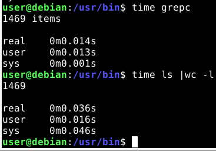

 Run the commands one after another in `/usr/bin`.

# grepc [](https://github.com/su8/grepc/actions/workflows/c-cpp.yml)
Faster **wc** implementation program. I made it for fun, this program ain't going to replace ordinary `wc` anytime soon.

# Compile

```make
make -j8 # to use 8 cores/threads in parallel compile
sudo make install
```

Now to run the program type `grepc -m .` or if you want to use it from a pipe `ls | grepc -l` .

# Compile the GUI with:

```bash
mkdir -p build
cp -r CMakeLists.txt mainwindow.h mainwindow.cpp mainwindow.ui build/
cd build
cmake .
make -j8 # 8 cores/threads to use in parallel compile
sudo make install
sudo mv /usr/bin/main /usr/bin/grepcg

# To start it
grepcg
```

If on windows, you'll have to download the online [Qt installer](https://www.qt.io/cs/c/?cta_guid=074ddad0-fdef-4e53-8aa8-5e8a876d6ab4&signature=AAH58kEJJxpduKtfibJ40aRNSB4V5QaI1A&pageId=12602948080&placement_guid=99d9dd4f-5681-48d2-b096-470725510d34&click=559deaff-10e4-44a7-a78c-ef8b98f3c31a&hsutk=&canon=https%3A%2F%2Fwww.qt.io%2Fdownload-open-source&portal_id=149513&redirect_url=APefjpGq5H2gLEy0rkYfu04Stc7zjmm0KqS_XaAVoOUeI1pUOzGQZgD_zg87kf-KWNMA8LagnlFie8sOAzzTMW8z48C4QlIP08Ykoqpk2QaLznoki0aaOBah-YfMzg2wugOl_TcZQF2S) and install Qt 6 **manually** from the GUI installer.


---

## Program options

**You must specify which option to use. Without specifying one, the program won't do anything.**

`-m` prints the total number of files and folders for each given folder right after the **-m** option

`-b` prints the total bytes for given file in a row and you can specify folder to traverse right after the `-b` option

`-l` prints count the total input given from `stdin` input, e.g. feeded by other programs in a pipe

---

## Windows users

Tested with [Visual Studio Code Editor](https://code.visualstudio.com/download), but you need to install [MingW](https://github.com/niXman/mingw-builds-binaries/releases/download/12.2.0-rt_v10-rev0/x86_64-12.2.0-release-posix-seh-rt_v10-rev0.7z), once downloaded extract it to **C:\MingW**, then re-open [Visual Studio Code Editor](https://code.visualstudio.com/download), you might want to install C\C++ extensions if you plan to write C\C++ code with the editor. If you plan to contribute to this project go to **File->Preferences->Settings** and type to search for **cppStandard** and set it to c17 to both C++ and C.

I use **One Monokai** theme for the [VScode Editor](https://code.visualstudio.com/download)

In [Visual Studio Code Editor](https://code.visualstudio.com/download), go to **Terminal->Configure Tasks...->Create tasks.json from template** and copy and paste this into it:

```json
{
  "version": "2.0.0",
  "tasks": [
    {
        "type": "cppbuild",
        "label": "C/C++",
        "command": "C:\\MingW\\bin\\g++.exe",
        "args": [
            "-fdiagnostics-color=always",
            "-std=c++17",
            "-ggdb",
            "-lpthread",
            "-Wall",
            "-Wextra",
            "-O2",
            "-pipe",
            "-pedantic",
            "-Wundef",
            "-Wshadow",
            "-W",
            "-Wwrite-strings",
            "-Wcast-align",
            "-Wstrict-overflow=5",
            "-Wconversion",
            "-Wpointer-arith",
            "-Wformat=2",
            "-Wsign-compare",
            "-Wendif-labels",
            "-Wredundant-decls",
            "-Winit-self",
            "${file}",
            "-o",
            "${fileDirname}/${fileBasenameNoExtension}"
        ],
        "options": {
            "cwd": "C:\\MingW\\bin"
        },
        "problemMatcher": [
            "$gcc"
        ],
        "group": {
            "kind": "build",
            "isDefault": true
        },
        "detail": "compiler: C:\\MingW\\bin\\g++.exe"
    }
]
}
```

Optioanlly if you want to play around with the code from VSCode's console -- press `CTRL + SHIFT + B` wait until it compiles, after that press **CTRL** + **\`** and paste this `cp -r C:\Users\YOUR_USERNAME_GOES_HERE\Desktop\main.exe C:\MingW\bin;cd C:\MingW\bin;.\main.exe`

---

## Uninstall

```make
sudo make uninstall
```
